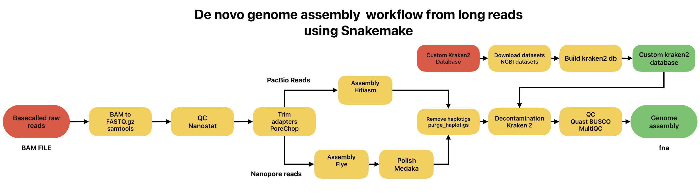

# De novo genome assembly workflow for mammalian species using long reads workflow

## Introduction
This workflow supports sequecing data from both Oxford Nanopore and Pacbio HiFi sequencers, built with snakemake for maximum compatibility.
The pipeline is based on the one used in _De Novo Genome Assembly for an Endangered Lemur Using Portable Nanopore Sequencing in Rural Madagascar_(Hauff et. all, 2025).

## Workflow
### Pipeline structure



### Project structure
```bash
.
├── config
│   └── config.yaml
├── data
├── kraken2_db.sh
├── LICENSE
├── logs
├── README.md
├── results
├── rules
│   ├── assembly.smk
│   ├── custom_k2_db.smk
│   ├── decontamination.smk
│   ├── envs
│   │   ├── assembly.yaml
│   │   ├── decontamination.yaml
│   │   ├── polish.yaml
│   │   ├── qc.yaml
│   │   ├── rm_haplotigs.yaml
│   │   └── trim_adapters.yaml
│   ├── polish.smk
│   ├── qc.smk
│   ├── rm_haplotigs.smk
│   └── trim_adapters.smk
├── scripts
│   └── reset.sh
├── setup.sh
├── snakefile
└── workflow.sh
```	
### System requirements
The workflow works mainly on **Linux x86-64 HPC** systems. It's currently being tested on a macOS system with M4 ARM CPU.

The total resources needed are based on the size of the data and the genome that is been analyzed.

**Recomended specs**

- GNU Linux 64 bit
- x86-64 CPU Architecture, Min: 32 Cores
- A lot of RAM, Min: 120GB
- Slurm Workload Manager 

Some recomended options on threads:
(These are the default settings in `config.yaml` based on the _Saccharomyces cerevisiae_)

| Tool | Threads |
|------|---------|
| samtools | 16 |
| porechop | 16 |
| flye | 32 |
| hifiasm | 32 |
| medaka | 8 |
| purge_dups | 16 |
| kraken2 | 16 |
| nanostat | 8 |
| quast | 8 |
| busco | 16 |
| multiqc | 8 |

### Depedencies
- **Flye**
- **Hifiasm**
- **Porechop**
- **Medaka**
- **Purge_dups**
- **QUAST**
- **BUSCO**
- **Kraken 2**
- **Seqkit**
- **Samtools**
- **NCBI Datasets** (_Optional_)
- **BlobToolkit** (_Optional_)

## Installation
### 1. Conda
In order to run the workflow, conda must be installed. Bellow are the full steps for installing and setup conda and bioconda for Linux machines. If you want to experiment with other configurations and distros, [here are the instructions](https://docs.conda.io/projects/conda/en/stable/user-guide/install/index.html#regular-installation).

_Taken from the official conda documentation._

**Download the installer**:
- Miniconda installer for Linux --> [link](https://docs.anaconda.com/miniconda/)
- Anaconda Distribution installer for Linux --> [link](https://www.anaconda.com/download/)
- Miniforge installer for Linux --> [link](https://conda-forge.org/download/)

**Verify your installer hashes** --> [link](https://docs.conda.io/projects/conda/en/stable/user-guide/install/index.html#hash-verification)

**Run this command**:
```bash
bash <conda-installer-name>-latest-Linux-x86_64.sh
```
`conda-installer-name` will be one of "Miniconda3", "Anaconda", or "Miniforge3".

Then follow instructions on screen.

**Verify installation with**:
```bash
conda list
```
**Setup Bioconda**:

To add the bioconda channel on `~/.condarc` file, run the following in the correct order:
```bash
conda config --add channels bioconda
conda config --add channels conda-forge
conda config --set channel_priority strict
```

Even if you have a previous bioconda setup, it is recommended to re-run these commands.
### 2. Setup workflow

**Download the repository**:
You can simply `git clone` the repo, or download it manually from GitHub or the new GitHub CLI app.
```bash
git clone https://github.com/mikeph52/de_novo_assembly_workflow.git
```
**Run setup.sh from inside the folder**:
```bash
./setup.sh
# or
bash setup.sh
```
Follow instructions. The `setup.sh` script enables you to rename the folder to your liking, creates importand project folders, checks for an existent conda installation and installs snakemake if it's not installed.

Here's an example of the script:
```
-------------------------------------
|De novo assembly snakemake workflow|
|         by mikeph52, 2026         |
-------------------------------------
Enter project name: pseudomonas_syringae
The following changes will happen:
 - Name project pseudomonas_syringae
 - Create directories: data/ logs/ results/
 - Create subfolders on: data/ results/
 - Check conda availability
 - Install snakemake if it is not installed
 - Move setup.sh to scripts/
Continue? (Y/N): 
```
### 3. Reset installation
If you want to revert changes made by the `setup.sh` script, run the `reset.sh` inside the `scripts/` folder.

## Usage
### Workflow configuration
All settings and configuration is managed from the [config.yaml](config/config.yaml), found in the `config/` folder. Inside the config file there are 5 sections:

- **Samples**
Load your .BAM files here.

```yaml
samples: #.BAM files
  - sample1
  - sample2
  # etc
```
- **Assembler**

Select the assembler to use on the assembly between **Flye** for Nanopore reads and **Hifiasm** for PacBio HiFi reads.
```yaml
assembler: flye #flye or hifiasm
```

- **Genome size**

Enter the genome size of the organism. It's required for **Flye** and **QUAST** to run.
```yaml
genome_size: "500m"
```

- **Threads**

Select the threads for each tool, depending on the available resources and the 

```yaml
threads:
  samtools: 16
  porechop: 16
  flye: 32
# . . . 
```

- **Tools arguments**
Here you can add additional arguments for the tools in this workflow.

```yaml
flye:
  read_type: "--nano-hq"    # --nano-raw # --nano-hq # --pacbio-raw # --pacbio-hifi
  extra_args: ""

busco:
  lineage: "fungi_odb10" # example for S.cerevisiae
  mode: "genome"
  extra_args: ""
# . . . 
```

### Execution with Slurm
To execute the workflow in an HPC System with the Slurm workflow manager installed, execute the `workflow.sh` script.
```bash
sbatch workflow.sh
```
### Manual execution
Inside the project folder, run the following:
```bash
snakemake -j 20 # select the cores you need
```

## Acknowledgements

All data used for the development of this workflow were provided by the
**Institute of Marine Biology, Biotechnology and Aquaculture (IMBBC)**
of the **Hellenic Centre for Marine Research (HCMR)**, Heraklion, Crete.
This workflow was ~~developed and~~ executed on the **Zorbas HPC** infrastructure of IMBBC-HCMR.

## References
- Hauff, L., Rasoanaivo, N.E., Razafindrakoto, A., Ravelonjanahary, H., Wright, P.C., Rakotoarivony, R. and Bergey, C.M. (2025), De Novo Genome Assembly for an Endangered Lemur Using Portable Nanopore Sequencing in Rural Madagascar. Ecol Evol, 15: e70734. [https://doi.org/10.1002/ece3.70734](https://doi.org/10.1002/ece3.70734)
- Bekavac M, Coimbra R, Busa VF, et al. De novo genome assembly of Ansell's mole-rat (Fukomys anselli). G3 (Bethesda). 2026;16(1):jkaf271. doi:10.1093/g3journal/jkaf271
- Kolmogorov, M., Yuan, J., Lin, Y. et al. Assembly of long, error-prone reads using repeat graphs. Nat Biotechnol 37, 540–546 (2019). https://doi.org/10.1038/s41587-019-0072-8
- Cheng, H., Asri, M., Lucas, J., Koren, S., Li, H. (2024) Scalable telomere-to-telomere assembly for diploid and polyploid genomes with double graph. Nat Methods, 21:967-970. https://doi.org/10.1038/s41592-024-02269-8
- Tegenfeldt F., Kuznetsov D., Manni M., Berkeley M., Zdobnov E.M., Kriventseva E.V. OrthoDB and BUSCO update: annotation of orthologs with wider sampling of genomes.  Nucleic Acids Research, Volume 53, Issue D1, 6 January 2025, Pages D516–D522, https://doi.org/10.1093/nar/gkae987
- Alla Mikheenko, Vladislav Saveliev, Pascal Hirsch, Alexey Gurevich,
WebQUAST: online evaluation of genome assemblies,
Nucleic Acids Research (2023) 51 (W1): W601–W606. doi: 10.1093/nar/gkad406
First published online: May 17, 2023
- Wood, D.E., Lu, J. & Langmead, B. Improved metagenomic analysis with Kraken 2. Genome Biol 20, 257 (2019). https://doi.org/10.1186/s13059-019-1891-0
- Guan D, McCarthy SA, Wood J, Howe K, Wang Y, Durbin R. Identifying and removing haplotypic duplication in primary genome assemblies. Bioinformatics. 2020 May 1;36(9):2896-2898. doi: 10.1093/bioinformatics/btaa025. PMID: 31971576; PMCID: PMC7203741.
- Shen, Wei, BotondSipos, and LiuyangZhao. 2024. “SeqKit2: A Swiss Army Knife for Sequence and Alignment Processing.” iMeta3, e191. https://doi.org/10.1002/imt2.191
